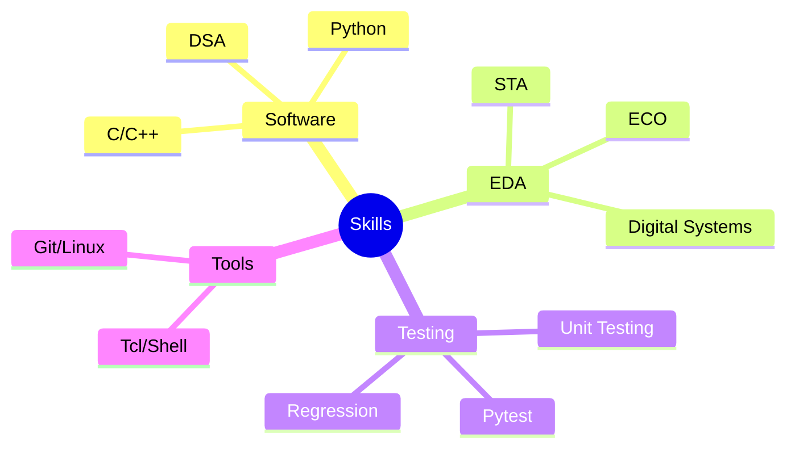

# 👋 Hi, I'm Amol Satsangi 

## 🚀 Professional Journey
Currently crafting efficient solutions as a **Product Engineer** at **Cadence Design Systems**, specializing in Static Timing Analysis and ECO optimization. Previously, I contributed to innovation at **Keysight Technologies** as a Software Engineer. My academic foundation in Computer Science from **Dayalbagh Educational Institute** fuels my passion for technological excellence.

## 💡 Core Competencies

<!-- Programming Languages -->

### 📊 GitHub Stats

  
  

### 🔗 Connect With Me

  
  
  

